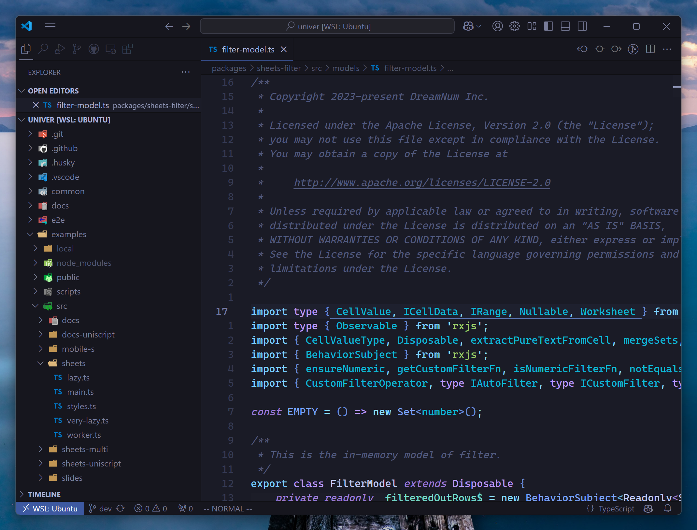

# Dotfiles

This repository contains my configurations for WSL and macOS, designed to create efficient development environments for _practical minimalists_ like myself.

## Introduction

### OS

I primarily use WSL as development environment.

### Editor

My choice is [Visual Studio Code](https://code.visualstudio.com/) because it performs better with large codebases and offers superior GitHub integration, especially for reviewing pull requests. My VS Code profile can be found [here](https://gist.github.com/wzhudev/578d871aa553e7c849be2924a67dc387). And I use the vim extension.

### Devtools

[Windows Terminal](https://github.com/mirosoft/terminal) on Windows and Terminal on macOS.

Some of my tools include:

- [**Homebrew**](https://brew.sh/): To manage packages on both WSL and macOS.
- [**stow**](https://www.gnu.org/software/stow/): For managing dotfiles.
- [**mise**](https://github.com/jdx/mise): For managing programming languages such as JavaScript, Rust, and Golang. And [**miniconda**](https://docs.conda.io/en/latest/miniconda.html) for Python.
- [**gh**](https://cli.github.com/) and [**lazygit**](https://github.com/jesseduffield/lazygit): For Git workflows.
- [**fzf**](https://github.com/junegunn/fzf), [**lazydocker**](https://github.com/jesseduffield/lazydocker), [**starship**](https://github.com/starship/starship), **tmux**, etc.

## Setup (Windows & WSL)

Follow the setup guides for [Windows setup guide](./platforms/windows/README.md) and [WSL setup guide](./platforms/linux/README.md).

## Setup (macOS)

Refer to the [macOS setup guide](./platforms/mac/README.md).
